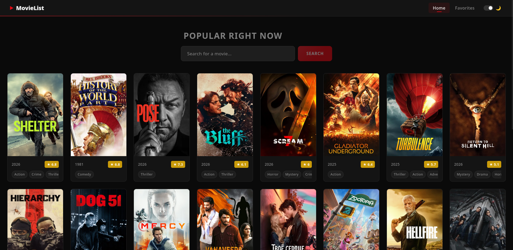
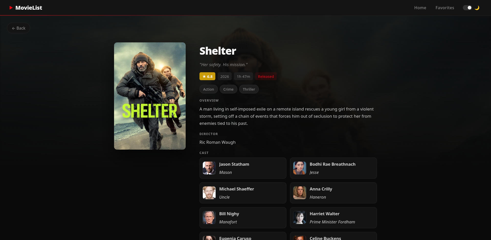
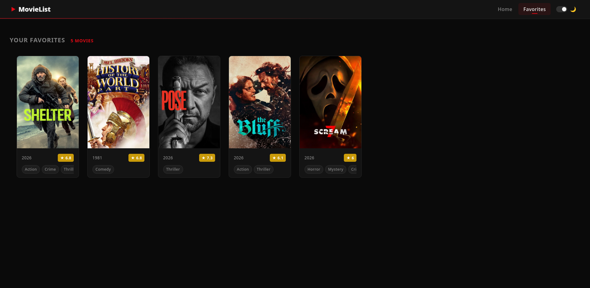
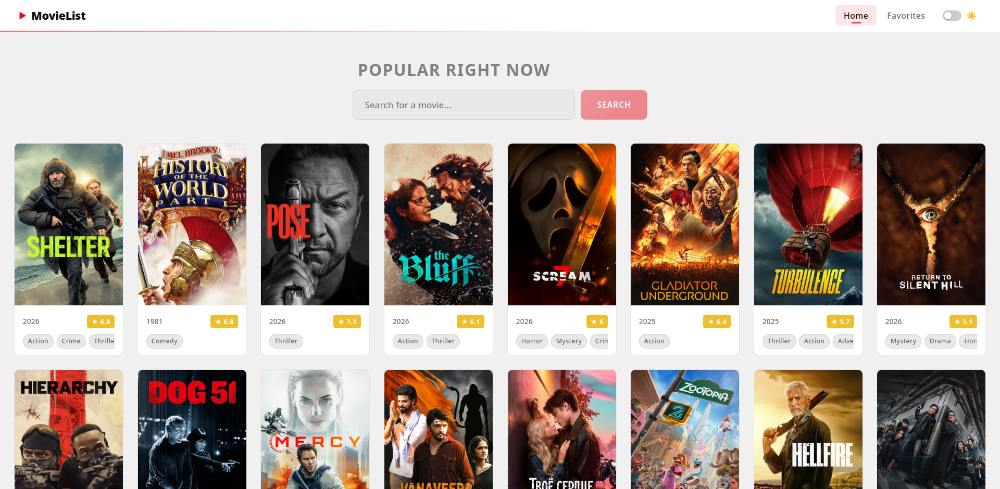
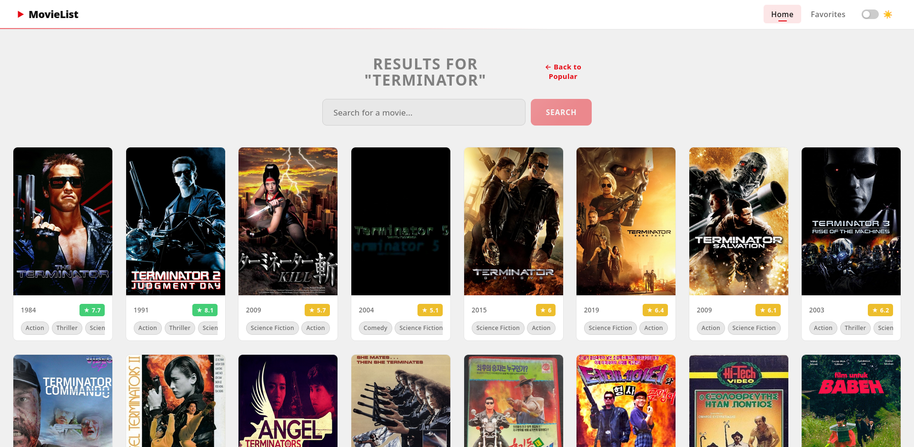

# 🎬 Movie Explorer

A modern React movie browsing application that allows users to search movies, view detailed information, watch trailers, and manage a favorites list.

## 🚀 Live Demo
[https://your-vercel-link.vercel.app](https://movie-list-7zl641h05-eto0001s-projects.vercel.app/)

## ✨ Features

- 🔍 Search movies using TMDB API
- 🎥 View movie details, cast, and trailers
- ⭐ Add / remove movies from favorites
- 💾 Favorites stored in localStorage
- 🌙 Dark / Light mode toggle
- 🎬 Embedded YouTube trailers
- 🎭 Cast information
- 🎨 Favorite button animation
- 📱 Responsive design

## 🛠 Tech Stack

- React
- Context API
- JavaScript (ES6+)
- CSS
- TMDB API
- Vite

## 📸 Screenshots

### Homepage

### Movie Details Page

### Favorites Page

### Light Mode Toogle

### Search Option

### Pagination

## 📦 Installation

git clone https://github.com/yourusername/movie-list.git

cd movie-list

npm install

npm run dev

## 🔑 Environment Variables

Create a `.env` file and add:

VITE_API_KEY=your_tmdb_api_key
